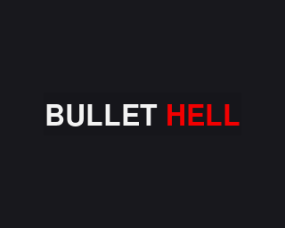

# Bullet Hell

Entry for the Ludum Dare 40.

This branch will receive periodic updates while I learn about making games in Javascript.

Play the current version [online.](https://bl.ocks.org/bad-software/raw/7624b2f19bb31e6456a74df21d6906a0/)

Play the original [online](https://bl.ocks.org/bad-software/raw/d6a7fc7e173f8ffbac575bf5c848140c/)
or view its source [here.](https://github.com/bad-software/bullet-hell/tree/original)

#### Requirements

* [`npm`](https://www.npmjs.com) or [`yarn`](https://yarnpkg.com)

## Install
Clone this repository and then install the node packages with `npm install` or `yarn install`.

## Run

##### Production

`npm build` || `yarn build`

Populates `/public` with both minified and compressed assets. After building the files, `/public` contains everything you need to run the game. Either load the index file in your browser or host the public folder with a web server.

`http-server` is included as a node package and running `npm serve` or `yarn serve` will start a server on localhost:8080

##### Development

`npm build:devserver` || `yarn build:devserver`

This will start a development server at localhost:8080 that automatically reloads the browser when a change is detected.

## Notes

##### About the game

This game was made over a weekend for the [Ludum Dare](https://ldjam.com) game jam. As such, the code isn't all well thought out. There's a little duct tape. Still, it presents an interesting use case for both Mithril and Matter.js that is simple and easy to comprehend.

An updated version of this game with sound, pickups, a few more enemies, minor graphical updates, refined controls and an online high score system is in the works.

##### About the code

This game makes use of [Mithril](https://mithril.js.org) and [Matter.js](http://brm.io/matter-js/).

There is a shim in the `/public` directory that is necessary for Matter.js to decompose svg files. You can find the project [here](https://github.com/schteppe/poly-decomp.js/).
